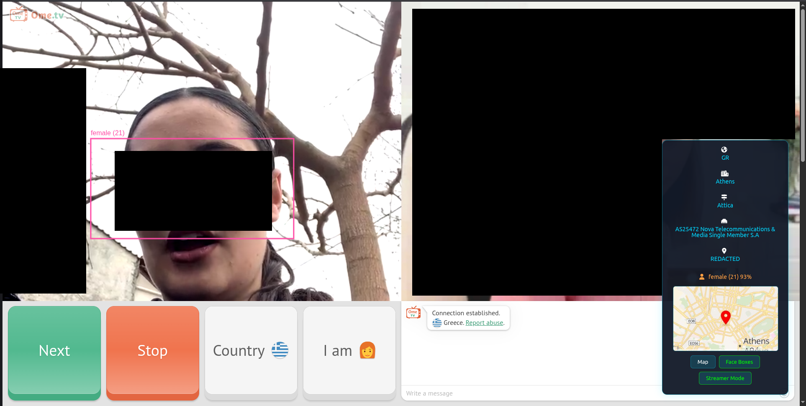
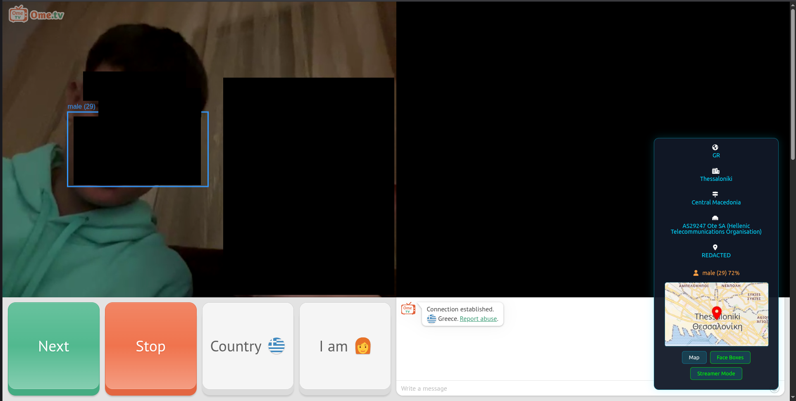

  

IP tracing and GeoIP mapping userscript for OmeTV with face analysis and static map previews.

**Highlights**
- 🛰️ IP lookups via IPInfo
- 🗺️ Static map previews via Geoapify

**Quick Install**
1. Install Violentmonkey from https://violentmonkey.github.io/get-it/
2. Click this raw URL to install the userscript: https://raw.githubusercontent.com/nom0x0nk/OmeTrace/main/ometrace.user.js

Violentmonkey will open and prompt you to install.

3. After installation, edit the userscript and set your `IPINFO_API_KEY` and `GEOAPIFY_API_KEY` constants.
4. Visit https://ome.tv — the overlay appears when a WebRTC connection is established.

**Features**
- 🔎 Capture public IP from WebRTC candidates and fetch geo info
- 🗺️ Show static map with marker and open full map on click
- 🧑‍🦱 Draw optional face boxes and show age/gender estimates
- 🔒 Streamer Mode to redact IP in UI

**Demo**

| | |
|---|---|
|  |  |

**API Keys**

- **IPInfo (IP lookups):**
	1. Open https://ipinfo.io/signup and create an account.
	2. Log in and open your dashboard at https://ipinfo.io/dashboard.
	3. Find and copy the **API Token** shown on the dashboard.
	4. Paste that token into the `IPINFO_API_KEY` constant in `ometrace.user.js`.
	5. Example token format from the script: `c8d4712fa90b63`.

- **Geoapify (static maps):**
	1. Open https://myprojects.geoapify.com/register and create an account.
	2. In the Geoapify dashboard, add a new project ("Create project" / "Add new project").
	3. Open the project and copy the API key from the project's API Keys section.
	4. Paste that key into the `GEOAPIFY_API_KEY` constant in `ometrace.user.js`.
	5. Example key format from the script: `3f8a1c7d9b2e4f6a5c8d1b7e3f2a9c40`.

**Notes & Links**
- The userscript loads Face-API for optional detection and uses IPInfo + Geoapify for location and maps.
- Source script: [ometrace.user.js](ometrace.user.js)